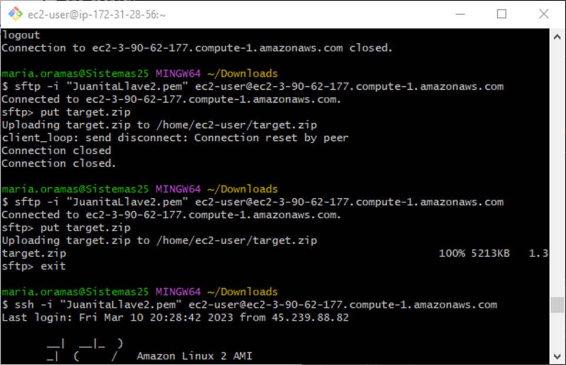

# Taller Docker AWS

## TALLER DE DE MODULARIZACIÓN CON VIRTUALIZACIÓN E INTRODUCCIÓN A DOCKER Y A AWS

## Author

**Maria Juanita Oramas Bermudez**

---


El taller consiste en crear una aplicación con la arquitectura propuesta y desplegarla en AWS usando EC2, ELB y autoescalado.

Arquitectura:


Se crearon las máquinas virtuales en AWS:


Se le agrega java con el comando 
```
sudo yum install java-17-amazon-corretto-devel
```

Se accede a las terminales de cada una
Se corren los servicios:

```
java -cp target/classes:target/dependency/*ruta.archivo
```
Para entender mejor cual es cada una, en este ejemplo: 




Instalacion de mongo:


Se accede y se pone a correr con el comando 
```
mongosh
```


Prueba que corra en alguna:


Se verifica enviando un mensaje, enviando la peticion a una de las maquinas de LogService y que vallan cambiando (para verificar el funcionamiento del RoundRobin)


### Instrucciones de uso
Para poder usar el proyecto lo primero que debe realizar es clonar este repositorio utilizando el siguiente comando desde la terminal del SO que esté utilizando:
```
git clone https://github.com/JuanitaOramas/AREP_Tallerr_DockerAWS
```
Luego debe redirigirse por medio de la terminal al directorio raíz la cual contiene el achivo pom.xml.

Una vez se encuentre en este directorio se debe compilar el programa para esto se debe ejecutar el siguiente comando:
```
mvn package
```
Para verificar la integridad del código

Para correr la clase main.java, corremos el siguiente comando en la terminal:
```
mvn compile
```

---
### Prerrequisitos

El proyecto se hizo con Maven, para visualizarlo se debe tener un framework que permita la instalacion y visualizacion de esta.
Se debe verificar las versiones:

```
Java - Desarrollo (backend)
git - Sistema de control de versiones
maven - Administrador de dependencias


```

### Instalación

Para la instalación, se puede clonar este repositorio con:

```
git clone
```


## Despliegue


Para la compilación del proyecto se usa el comando:
```
mvn clean
mvn install
```

Para visualizar de la aplicación  *http://localhost:35000* desde un navegador web.

---
## Diseño
Arquitectura cliente/servidor el cual realiza peticiones a una API que implementa el algoritmo RoundRobin.

### AWS
Creamos una instancia de Ec2


---

## Inicial:
Pruebas:


En AWS:


Resultado Final:


---

## Construido con:

* [Intellij](http://www.dropwizard.io/1.0.2/docs/) - The web framework used
* [Maven](https://maven.apache.org/) - Dependency Management


